# DOCUMENT D'ANALYSE FONCTIONNELLE
## PLATEFORME IMMOBILIÈRE DOMIORA

---

## TABLE DES MATIÈRES

1. [Vision Générale de DOMIORA](#1-vision-générale-de-domiora)
2. [Acteurs Principaux](#2-acteurs-principaux)
3. [Agent de Vérification DOMIORA](#3-agent-de-vérification-domiora)
4. [Moyen de Paiement](#4-moyen-de-paiement)
5. [Vérification Physique](#5-vérification-physique)
6. [Règles de Gestion](#6-règles-de-gestion)
7. [Diagrammes](#7-diagrammes)
   - 7.1.1 [Diagramme de Contexte](#711-diagramme-de-contexte)
   - 7.1.2 [Diagramme de Package](#712-diagramme-de-package)
   - 7.1.3 [Diagrammes de Cas d'Utilisation](#713-diagrammes-de-cas-dutilisation)
   - 7.1.4 [Diagrammes d'Activités](#714-diagrammes-dactivités)
   - 7.1.5 [Diagrammes de Séquences](#715-diagrammes-de-séquences)
   - 7.1.6 [Diagramme de Classes](#716-diagramme-de-classes)
   - 7.1.7 [Diagrammes d'Objets](#717-diagrammes-dobjets)
   - 7.1.8 [Diagramme d'État-Transition](#718-diagramme-détat-transition)
   - 7.1.9 [Modèle Entité-Relationnel](#719-modèle-entité-relationnel)

---

## 1. VISION GÉNÉRALE DE DOMIORA

DOMIORA est une plateforme immobilière innovante permettant aux utilisateurs de consulter des biens immobiliers, aux propriétaires de proposer leurs biens et aux administrateurs de contrôler la fiabilité des propriétaires et des annonces.

La plateforme se distingue par son système de vérification physique rigoureux garantissant l'authenticité des annonces et la sécurité des transactions.

### 1.1 Objectifs Principaux

- Faciliter la consultation et la recherche de biens immobiliers
- Sécuriser les transactions par un système de vérification d'identité
- Lutter contre les fraudes et les fausses annonces
- Garantir la transparence entre clients et propriétaires
- Offrir une expérience utilisateur fluide et sécurisée

### 1.2 Écosystème DOMIORA

Le système repose principalement sur **TROIS ACTEURS HUMAINS** :

1. **CLIENT / UTILISATEUR** : Consulte les biens, effectue des recherches, contacte les propriétaires
2. **PROPRIÉTAIRE / AGENT IMMOBILIER** : Propose des biens, gère ses annonces, communique avec les clients
3. **ADMINISTRATEUR** : Gère la plateforme, valide les propriétaires et les annonces, supervise les opérations

Un **AGENT DE VÉRIFICATION DOMIORA** intervient également dans le processus de vérification physique, mais il ne constitue PAS un acteur métier principal indépendant de la plateforme.

---

## 2. ACTEURS PRINCIPAUX

### 2.1 CLIENT / UTILISATEUR

Le Client / Utilisateur peut accéder librement à DOMIORA sans obligatoirement créer un compte pour consulter les biens publics.

**Fonctionnalités principales :**

- Consulter les biens immobiliers
- Rechercher des biens selon différents critères
- Filtrer les résultats (prix, localisation, type de bien, etc.)
- Consulter les détails d'un bien
- Consulter les informations publiques d'un bien
- Ajouter des biens aux favoris
- Demander à contacter un propriétaire
- Effectuer un paiement via FedaPay
- Communiquer avec un propriétaire après mise en relation
- Envoyer des messages
- Demander une visite
- Prendre rendez-vous

**Règle importante :** Les coordonnées privées du propriétaire ne doivent jamais être affichées publiquement.

Lorsqu'un client souhaite contacter un propriétaire avec lequel il n'existe encore aucune relation, il doit effectuer le paiement de mise en relation via FedaPay.

Après confirmation du paiement :
- La relation Client-Propriétaire est créée
- Le compte client est créé si nécessaire
- Les identifiants sont fournis au client
- Le contact avec le propriétaire est débloqué
- La messagerie devient accessible
- Les demandes de visite deviennent accessibles

**Règle de paiement par propriétaire :** Le paiement concerne le PROPRIÉTAIRE et non le bien immobilier. Si un client a déjà payé pour être mis en relation avec un propriétaire, il ne doit pas payer une seconde fois pour consulter ou contacter un autre bien appartenant au même propriétaire.

DOMIORA doit donc vérifier l'existence d'une relation valide entre le client et le propriétaire avant de demander un nouveau paiement.

### 2.2 PROPRIÉTAIRE / AGENT IMMOBILIER

Le Propriétaire / Agent immobilier est la personne qui propose des biens immobiliers sur DOMIORA.

**Fonctionnalités principales :**

- Créer un compte
- Se connecter
- Gérer son profil
- Fournir ses informations personnelles
- Soumettre une pièce d'identité
- Suivre l'état de sa vérification
- Créer une annonce
- Modifier une annonce
- Supprimer une annonce
- Consulter ses annonces
- Gérer ses biens
- Gérer les demandes de visite
- Répondre aux messages des clients avec lesquels une relation existe
- Proposer une visite virtuelle
- Consulter ses statistiques

**Processus de vérification :** Un propriétaire nouvellement inscrit n'est PAS automatiquement considéré comme vérifié.

Après son inscription et la soumission de sa pièce d'identité :
- **STATUT DU PROPRIÉTAIRE = « EN ATTENTE DE VÉRIFICATION »**

Le propriétaire doit attendre la fin du processus de vérification. Le message suivant doit être affiché dans son espace :

> « Vérification de votre identité en cours
>
> Pour garantir la sécurité de notre plateforme et lutter contre les fraudes, DOMIORA procède à une vérification de votre identité et de votre bien. Un de nos agents pourra vous contacter afin d'effectuer une vérification sur place.
>
> Merci de patienter. Votre compte et vos annonces seront activés après validation de cette étape par notre équipe. »

Pendant cette période, le propriétaire ne peut pas publier définitivement ses annonces.

### 2.3 ADMINISTRATEUR

L'Administrateur est l'autorité principale de DOMIORA. Il possède le tableau de bord d'administration.

**Fonctionnalités principales :**

- Consulter les statistiques globales
- Gérer les utilisateurs
- Consulter les propriétaires inscrits
- Consulter les propriétaires en attente
- Consulter les pièces d'identité
- Demander une vérification physique
- Sélectionner un agent de vérification
- Attribuer une mission
- Consulter les rapports de vérification
- Valider un propriétaire
- Refuser un propriétaire
- Demander une nouvelle vérification
- Demander une nouvelle soumission de documents
- Gérer les annonces
- Valider une annonce
- Refuser une annonce
- Suspendre une annonce
- Gérer les agents de vérification
- Superviser les transactions FedaPay
- Consulter les relations Client-Propriétaire
- Consulter les statistiques
- Générer des rapports

**Règle fondamentale :** L'Administrateur est le SEUL acteur humain qui peut prendre la décision finale concernant la validation du propriétaire.

**Processus de validation :**

```
Propriétaire inscrit
        ↓
Pièce d'identité soumise
        ↓
Statut « En attente de vérification »
        ↓
Administrateur demande une vérification
        ↓
Administrateur choisit un agent
        ↓
Agent effectue la vérification sur le terrain
        ↓
Agent rédige un rapport
        ↓
Rapport transmis à l'administrateur
        ↓
Administrateur analyse le rapport
        ↓
VALIDATION ou REFUS
        ↓
Si validé : le propriétaire peut faire valider ses annonces
```

---

## 3. AGENT DE VÉRIFICATION DOMIORA

L'Agent de vérification n'est PAS un acteur métier principal de DOMIORA. Il intervient uniquement comme intervenant opérationnel dans le processus de vérification.

Il ne possède pas de tableau de bord complet dédié. L'administrateur est responsable de son affectation et du suivi de sa mission.

### 3.1 Fonctionnalités de l'Agent

L'agent peut recevoir les informations nécessaires à une mission et effectuer les actions suivantes :

- Prendre connaissance de la mission
- Consulter les informations nécessaires concernant le propriétaire
- Consulter les documents nécessaires à la vérification
- Contacter le propriétaire
- Convenir d'un rendez-vous
- Se déplacer sur le lieu du bien
- Vérifier l'identité du propriétaire
- Comparer le propriétaire avec les documents fournis
- Vérifier l'existence réelle du bien
- Vérifier les informations déclarées concernant le bien
- Prendre des photos ou éléments justificatifs si nécessaire
- Rédiger un rapport
- Transmettre le rapport à l'administrateur

### 3.2 Limitations de l'Agent

L'Agent de vérification ne peut PAS :

- Valider définitivement un propriétaire
- Refuser définitivement un propriétaire
- Valider une annonce
- Suspendre un compte
- Gérer les utilisateurs
- Gérer les paiements
- Prendre une décision administrative

Il fait uniquement le travail de vérification et transmet ses constatations. La décision finale appartient exclusivement à l'administrateur.

---

## 4. MOYEN DE PAIEMENT

Le seul moyen de paiement utilisé par DOMIORA est **FEDAPAY**.

### 4.1 Processus de Paiement

```
Client
→ DOMIORA
→ FedaPay
→ Paiement
→ FedaPay confirme
→ DOMIORA reçoit la confirmation
→ DOMIORA vérifie la transaction
→ création ou confirmation de la relation Client-Propriétaire
→ déblocage de la communication
```

### 4.2 Sécurité

DOMIORA ne stocke pas les informations bancaires sensibles du client. Toutes les opérations de paiement sont sécurisées via FedaPay.

---

## 5. VÉRIFICATION PHYSIQUE

La vérification physique permet de lutter contre :

- Les fausses identités
- L'utilisation frauduleuse de pièces d'identité
- Les fausses annonces
- Les biens inexistants
- Les tentatives d'escroquerie

### 5.1 Processus de Vérification Physique

```
Inscription du propriétaire
→ Soumission de la pièce d'identité
→ Statut « En attente »
→ Administrateur consulte le dossier
→ Administrateur affecte un agent
→ Agent contacte le propriétaire
→ Visite sur le terrain
→ Vérification de l'identité
→ Vérification du bien
→ Collecte d'éléments justificatifs
→ Rédaction du rapport
→ Transmission à l'administrateur
→ Analyse du rapport
→ Décision finale de l'administrateur
```

### 5.2 Répartition des Responsabilités

**IMPORTANT :**

- L'agent **vérifie**
- L'administrateur **décide**

Cette distinction doit être respectée dans TOUS les diagrammes.

---

## 6. RÈGLES DE GESTION

### RG-01
Les coordonnées privées des propriétaires ne sont jamais affichées publiquement.

### RG-02
Un propriétaire ne peut pas publier une annonce tant que son identité n'a pas été validée.

### RG-03
Toute nouvelle annonce est placée en « En attente ».

### RG-04
Un client qui souhaite contacter un nouveau propriétaire doit payer via FedaPay.

### RG-05
Le paiement est associé au propriétaire et non au bien.

### RG-06
Une relation existante permet au client de contacter le propriétaire sans effectuer un nouveau paiement.

### RG-07
La messagerie et les demandes de visite nécessitent une relation Client-Propriétaire valide.

### RG-08
Après l'inscription et la soumission de la pièce d'identité, le propriétaire passe en « En attente de vérification ».

### RG-09
Une vérification physique peut être organisée par l'administrateur.

### RG-10
L'agent effectue la vérification sur le terrain et rédige un rapport.

### RG-11
L'agent ne prend aucune décision finale.

### RG-12
L'administrateur est le seul responsable de la validation ou du refus du propriétaire.

### RG-13
Une annonce ne peut être publiée que si le propriétaire est validé ET si l'annonce est validée par l'administrateur.

### RG-14
Une transaction FedaPay réussie crée ou confirme une relation Client-Propriétaire.

### RG-15
Une relation existante évite au client de repayer pour contacter le même propriétaire.

---

## 7. DIAGRAMMES

### 7.1.1 DIAGRAMME DE CONTEXTE

Le diagramme de contexte représente les interactions entre le système DOMIORA et ses acteurs externes.

```plantuml
@startuml
!define RECTANGLE class

skinparam rectangle {
    BackgroundColor #f8f9fa
    BorderColor #71212d
    BorderThickness 2
}

skinparam actor {
    BackgroundColor #e9ecef
    BorderColor #71212d
}

title Diagramme de Contexte - DOMIORA

actor "Client / Utilisateur" as CLIENT
actor "Propriétaire / Agent immobilier" as PROPRIETAIRE
actor "Administrateur" as ADMIN
actor "Agent de vérification DOMIORA" as AGENT
actor "FedaPay" as FEDAPAY

rectangle "Système DOMIORA" {
    rectangle "Consultation des biens" as CONSULTATION
    rectangle "Gestion des annonces" as ANNONCES
    rectangle "Vérification d'identité" as VERIFICATION
    rectangle "Mise en relation" as RELATION
    rectangle "Paiement" as PAIEMENT
    rectangle "Administration" as ADMINISTRATION
}

CLIENT --> CONSULTATION : Consulte les biens
CLIENT --> CONSULTATION : Recherche des biens
CLIENT --> CONSULTATION : Filtre les résultats
CLIENT --> RELATION : Demande de contact
CLIENT --> PAIEMENT : Effectue un paiement
CLIENT --> RELATION : Communique avec propriétaire
CLIENT --> RELATION : Demande une visite

PROPRIETAIRE --> ANNONCES : Crée des annonces
PROPRIETAIRE --> ANNONCES : Modifie des annonces
PROPRIETAIRE --> VERIFICATION : Soumet documents
PROPRIETAIRE --> VERIFICATION : Suit vérification
PROPRIETAIRE --> RELATION : Répond aux clients
PROPRIETAIRE --> RELATION : Gère les visites

ADMIN --> ADMINISTRATION : Gère les utilisateurs
ADMIN --> ADMINISTRATION : Valide les propriétaires
ADMIN --> ADMINISTRATION : Valide les annonces
ADMIN --> ADMINISTRATION : Affecte les agents
ADMIN --> ADMINISTRATION : Consulte les rapports
ADMIN --> ADMINISTRATION : Supervise les transactions

AGENT --> VERIFICATION : Reçoit mission
AGENT --> VERIFICATION : Vérifie identité
AGENT --> VERIFICATION : Vérifie bien
AGENT --> VERIFICATION : Rédige rapport

PAIEMENT --> FEDAPAY : Initie transaction
FEDAPAY --> PAIEMENT : Confirme paiement

note right of AGENT
  Agent de vérification :
  Intervenant externe
  mandaté par l'administrateur
  pour vérification physique
end note

note right of PAIEMENT
  Moyen de paiement
  exclusif : FedaPay
end note

@enduml
```

**Explication :** Ce diagramme montre les interactions entre le système DOMIORA et ses acteurs externes. L'agent de vérification est représenté comme un intervenant externe mandaté par l'administrateur. FedaPay est le système de paiement externe utilisé pour les transactions.

---

### 7.1.2 DIAGRAMME DE PACKAGE

Le diagramme de package présente l'organisation modulaire du système DOMIORA.

```plantuml
@startuml
skinparam package {
    BackgroundColor #f8f9fa
    BorderColor #71212d
    BorderThickness 2
}

skinparam packageStyle rectangle

title Diagramme de Package - DOMIORA

package "Système DOMIORA" {
    package "Authentification" {
        [Inscription]
        [Connexion]
        [Déconnexion]
        [Gestion des sessions]
    }

    package "Gestion des utilisateurs" {
        [Profil utilisateur]
        [Gestion des rôles]
        [Paramètres utilisateur]
    }

    package "Gestion des propriétaires" {
        [Compte propriétaire]
        [Informations personnelles]
        [Statut de vérification]
    }

    package "Vérification d'identité et du bien" {
        [Soumission des documents]
        [Affectation de la mission]
        [Vérification sur terrain]
        [Rapport de vérification]
        [Décision de l'administrateur]
    }

    package "Gestion des biens immobiliers" {
        [Création d'annonce]
        [Modification d'annonce]
        [Suppression d'annonce]
        [Validation d'annonce]
        [Publication d'annonce]
    }

    package "Mise en relation" {
        [Demande de contact]
        [Création de relation]
        [Vérification de relation]
        [Déblocage communication]
    }

    package "Paiement FedaPay" {
        [Initiation paiement]
        [Traitement FedaPay]
        [Confirmation paiement]
        [Vérification transaction]
    }

    package "Messagerie" {
        [Envoi de messages]
        [Réception de messages]
        [Historique des conversations]
    }

    package "Gestion des visites et rendez-vous" {
        [Demande de visite]
        [Planification rendez-vous]
        [Confirmation visite]
        [Annulation visite]
    }

    package "Administration" {
        [Gestion des utilisateurs]
        [Validation des propriétaires]
        [Validation des annonces]
        [Affectation des agents]
        [Supervision des transactions]
        [Rapports et statistiques]
    }

    package "Base de données" {
        [Utilisateurs]
        [Biens immobiliers]
        [Vérifications]
        [Relations]
        [Transactions]
        [Messages]
        [Visites]
    }
}

"Authentification" --> "Gestion des utilisateurs"
"Gestion des utilisateurs" --> "Gestion des propriétaires"
"Gestion des propriétaires" --> "Vérification d'identité et du bien"
"Vérification d'identité et du bien" --> "Administration"
"Gestion des propriétaires" --> "Gestion des biens immobiliers"
"Gestion des biens immobiliers" --> "Administration"
"Mise en relation" --> "Paiement FedaPay"
"Paiement FedaPay" --> "Mise en relation"
"Mise en relation" --> "Messagerie"
"Mise en relation" --> "Gestion des visites et rendez-vous"
"Administration" --> "Base de données"
"Gestion des utilisateurs" --> "Base de données"
"Gestion des propriétaires" --> "Base de données"
"Gestion des biens immobiliers" --> "Base de données"
"Vérification d'identité et du bien" --> "Base de données"
"Mise en relation" --> "Base de données"
"Paiement FedaPay" --> "Base de données"
"Messagerie" --> "Base de données"
"Gestion des visites et rendez-vous" --> "Base de données"

note right of "Vérification d'identité et du bien"
  Processus complet :
  Soumission → Affectation → Vérification
  → Rapport → Décision administrateur
end note

note right of "Paiement FedaPay"
  Communique uniquement
  avec FedaPay
end note

@enduml
```

**Explication :** Ce diagramme montre l'organisation modulaire du système DOMIORA. Le package de vérification d'identité et du bien illustre le processus complet de soumission à décision. Le package Paiement FedaPay communique uniquement avec le système externe FedaPay.

---

### 7.1.3 DIAGRAMMES DE CAS D'UTILISATION

#### 7.1.3.1 Diagramme Général

```plantuml
@startuml
left to right direction
skinparam actor {
    BackgroundColor #e9ecef
    BorderColor #71212d
}
skinparam usecase {
    BackgroundColor #f8f9fa
    BorderColor #71212d
}

title Diagramme de Cas d'Utilisation - Général

actor "Client / Utilisateur" as CLIENT
actor "Propriétaire / Agent immobilier" as PROPRIETAIRE
actor "Administrateur" as ADMIN
actor "Agent de vérification" as AGENT

package "Fonctionnalités Client" {
    usecase "Consulter les biens" as UC1
    usecase "Rechercher des biens" as UC2
    usecase "Filtrer les résultats" as UC3
    usecase "Consulter les détails d'un bien" as UC4
    usecase "Payer via FedaPay" as UC5
    usecase "Contacter un propriétaire" as UC6
    usecase "Envoyer des messages" as UC7
    usecase "Demander une visite" as UC8
}

package "Fonctionnalités Propriétaire" {
    usecase "S'inscrire" as UC9
    usecase "Se connecter" as UC10
    usecase "Soumettre ses documents" as UC11
    usecase "Suivre sa vérification" as UC12
    usecase "Gérer ses biens" as UC13
    usecase "Gérer ses annonces" as UC14
    usecase "Répondre aux clients" as UC15
    usecase "Gérer les visites" as UC16
}

package "Fonctionnalités Administrateur" {
    usecase "Gérer les utilisateurs" as UC17
    usecase "Consulter les dossiers" as UC18
    usecase "Affecter un agent" as UC19
    usecase "Consulter les rapports" as UC20
    usecase "Valider/Refuser un propriétaire" as UC21
    usecase "Valider/Refuser/Suspendre une annonce" as UC22
    usecase "Gérer les agents" as UC23
    usecase "Superviser FedaPay" as UC24
    usecase "Consulter les statistiques" as UC25
}

package "Fonctionnalités Agent de vérification" {
    usecase "Prendre connaissance d'une mission" as UC26
    usecase "Consulter les informations nécessaires" as UC27
    usecase "Contacter le propriétaire" as UC28
    usecase "Planifier la visite" as UC29
    usecase "Effectuer la vérification" as UC30
    usecase "Vérifier l'identité" as UC31
    usecase "Vérifier le bien" as UC32
    usecase "Prendre des éléments justificatifs" as UC33
    usecase "Rédiger le rapport" as UC34
    usecase "Transmettre le rapport" as UC35
}

CLIENT --> UC1
CLIENT --> UC2
CLIENT --> UC3
CLIENT --> UC4
CLIENT --> UC5
CLIENT --> UC6
CLIENT --> UC7
CLIENT --> UC8

PROPRIETAIRE --> UC9
PROPRIETAIRE --> UC10
PROPRIETAIRE --> UC11
PROPRIETAIRE --> UC12
PROPRIETAIRE --> UC13
PROPRIETAIRE --> UC14
PROPRIETAIRE --> UC15
PROPRIETAIRE --> UC16

ADMIN --> UC17
ADMIN --> UC18
ADMIN --> UC19
ADMIN --> UC20
ADMIN --> UC21
ADMIN --> UC22
ADMIN --> UC23
ADMIN --> UC24
ADMIN --> UC25

AGENT --> UC26
AGENT --> UC27
AGENT --> UC28
AGENT --> UC29
AGENT --> UC30
AGENT --> UC31
AGENT --> UC32
AGENT --> UC33
AGENT --> UC34
AGENT --> UC35

UC5 <<include>> UC6
UC6 <<include>> UC7
UC6 <<include>> UC8

UC11 <<include>> UC12
UC13 <<include>> UC14
UC15 <<include>> UC16

UC19 <<include>> UC20
UC20 <<include>> UC21

UC29 <<include>> UC30
UC30 <<include>> UC31
UC30 <<include>> UC32
UC30 <<include>> UC33
UC33 <<include>> UC34
UC34 <<include>> UC35

note right of AGENT
  L'agent de vérification
  ne peut PAS valider
  un propriétaire
end note

@enduml
```

**Explication :** Ce diagramme général présente tous les cas d'utilisation du système DOMIORA, séparés par acteur. Les relations entre cas d'utilisation sont représentées par les stéréotypes <<include>> et <<extend>>.

---

#### 7.1.3.2 Cas d'Utilisation du Client

```plantuml
@startuml
left to right direction
skinparam actor {
    BackgroundColor #e9ecef
    BorderColor #71212d
}
skinparam usecase {
    BackgroundColor #f8f9fa
    BorderColor #71212d
}

title Cas d'Utilisation - Client / Utilisateur

actor "Client / Utilisateur" as CLIENT

package "Consultation et Recherche" {
    usecase "Consulter les biens" as UC1
    usecase "Rechercher des biens" as UC2
    usecase "Filtrer les résultats" as UC3
    usecase "Consulter les détails d'un bien" as UC4
    usecase "Ajouter aux favoris" as UC5
}

package "Mise en Relation" {
    usecase "Demander à contacter un propriétaire" as UC6
    usecase "Payer via FedaPay" as UC7
    usecase "Vérifier la relation existante" as UC8
}

package "Communication" {
    usecase "Envoyer des messages" as UC9
    usecase "Recevoir des messages" as UC10
    usecase "Consulter l'historique" as UC11
}

package "Visites" {
    usecase "Demander une visite" as UC12
    usecase "Prendre rendez-vous" as UC13
    usecase "Annuler une visite" as UC14
}

CLIENT --> UC1
CLIENT --> UC2
CLIENT --> UC3
CLIENT --> UC4
CLIENT --> UC5
CLIENT --> UC6
CLIENT --> UC7
CLIENT --> UC8
CLIENT --> UC9
CLIENT --> UC10
CLIENT --> UC11
CLIENT --> UC12
CLIENT --> UC13
CLIENT --> UC14

UC6 <<extend>> UC7
UC8 <<extend>> UC6
UC7 <<include>> UC9
UC12 <<include>> UC13

note right of UC8
  Si relation existe :
  pas de nouveau paiement
end note

@enduml
```

**Explication :** Ce diagramme détaille les cas d'utilisation spécifiques au client. La vérification de la relation existante évite un nouveau paiement si le client a déjà payé pour ce propriétaire.

---

#### 7.1.3.3 Cas d'Utilisation du Propriétaire

```plantuml
@startuml
left to right direction
skinparam actor {
    BackgroundColor #e9ecef
    BorderColor #71212d
}
skinparam usecase {
    BackgroundColor #f8f9fa
    BorderColor #71212d
}

title Cas d'Utilisation - Propriétaire / Agent Immobilier

actor "Propriétaire / Agent immobilier" as PROPRIETAIRE

package "Gestion du Compte" {
    usecase "S'inscrire" as UC1
    usecase "Se connecter" as UC2
    usecase "Gérer son profil" as UC3
    usecase "Fournir ses informations personnelles" as UC4
}

package "Vérification" {
    usecase "Soumettre une pièce d'identité" as UC5
    usecase "Suivre l'état de sa vérification" as UC6
    usecase "Recevoir notification de vérification" as UC7
}

package "Gestion des Biens" {
    usecase "Créer une annonce" as UC8
    usecase "Modifier une annonce" as UC9
    usecase "Supprimer une annonce" as UC10
    usecase "Consulter ses annonces" as UC11
    usecase "Gérer ses biens" as UC12
}

package "Communication" {
    usecase "Répondre aux messages des clients" as UC13
    usecase "Contacter les clients" as UC14
}

package "Visites" {
    usecase "Gérer les demandes de visite" as UC15
    usecase "Proposer une visite virtuelle" as UC16
    usecase "Accepter/Refuser une visite" as UC17
}

package "Statistiques" {
    usecase "Consulter ses statistiques" as UC18
    usecase "Voir les vues de ses annonces" as UC19
}

PROPRIETAIRE --> UC1
PROPRIETAIRE --> UC2
PROPRIETAIRE --> UC3
PROPRIETAIRE --> UC4
PROPRIETAIRE --> UC5
PROPRIETAIRE --> UC6
PROPRIETAIRE --> UC7
PROPRIETAIRE --> UC8
PROPRIETAIRE --> UC9
PROPRIETAIRE --> UC10
PROPRIETAIRE --> UC11
PROPRIETAIRE --> UC12
PROPRIETAIRE --> UC13
PROPRIETAIRE --> UC14
PROPRIETAIRE --> UC15
PROPRIETAIRE --> UC16
PROPRIETAIRE --> UC17
PROPRIETAIRE --> UC18
PROPRIETAIRE --> UC19

UC5 <<include>> UC6
UC8 <<include>> UC12
UC13 <<include>> UC14
UC15 <<include>> UC17

note right of UC6
  Statut initial :
  "En attente de vérification"
end note

note right of UC8
  Impossible si propriétaire
  non validé
end note

@enduml
```

**Explication :** Ce diagramme présente les cas d'utilisation du propriétaire. La création d'annonces n'est possible que si le propriétaire est validé par l'administrateur.

---

#### 7.1.3.4 Cas d'Utilisation de l'Administrateur

```plantuml
@startuml
left to right direction
skinparam actor {
    BackgroundColor #e9ecef
    BorderColor #71212d
}
skinparam usecase {
    BackgroundColor #f8f9fa
    BorderColor #71212d
}

title Cas d'Utilisation - Administrateur

actor "Administrateur" as ADMIN

package "Gestion des Utilisateurs" {
    usecase "Consulter les utilisateurs" as UC1
    usecase "Gérer les utilisateurs" as UC2
    usecase "Consulter les propriétaires inscrits" as UC3
    usecase "Consulter les propriétaires en attente" as UC4
}

package "Vérification" {
    usecase "Consulter les pièces d'identité" as UC5
    usecase "Demander une vérification physique" as UC6
    usecase "Sélectionner un agent de vérification" as UC7
    usecase "Attribuer une mission" as UC8
    usecase "Consulter les rapports de vérification" as UC9
    usecase "Valider un propriétaire" as UC10
    usecase "Refuser un propriétaire" as UC11
    usecase "Demander une nouvelle vérification" as UC12
    usecase "Demander une nouvelle soumission de documents" as UC13
}

package "Gestion des Annonces" {
    usecase "Gérer les annonces" as UC14
    usecase "Valider une annonce" as UC15
    usecase "Refuser une annonce" as UC16
    usecase "Suspendre une annonce" as UC17
}

package "Gestion des Agents" {
    usecase "Gérer les agents de vérification" as UC18
    usecase "Consulter les missions en cours" as UC19
}

package "Supervision" {
    usecase "Superviser les transactions FedaPay" as UC20
    usecase "Consulter les relations Client-Propriétaire" as UC21
    usecase "Consulter les statistiques" as UC22
    usecase "Générer des rapports" as UC23
}

ADMIN --> UC1
ADMIN --> UC2
ADMIN --> UC3
ADMIN --> UC4
ADMIN --> UC5
ADMIN --> UC6
ADMIN --> UC7
ADMIN --> UC8
ADMIN --> UC9
ADMIN --> UC10
ADMIN --> UC11
ADMIN --> UC12
ADMIN --> UC13
ADMIN --> UC14
ADMIN --> UC15
ADMIN --> UC16
ADMIN --> UC17
ADMIN --> UC18
ADMIN --> UC19
ADMIN --> UC20
ADMIN --> UC21
ADMIN --> UC22
ADMIN --> UC23

UC6 <<include>> UC7
UC7 <<include>> UC8
UC8 <<include>> UC9
UC9 <<include>> UC10
UC9 <<include>> UC11
UC10 <<include>> UC15
UC11 <<include>> UC16

note right of UC10
  SEUL l'administrateur
  peut valider un propriétaire
end note

note right of UC9
  Le rapport vient de l'agent
  mais la décision revient
  à l'administrateur
end note

@enduml
```

**Explication :** Ce diagramme montre les cas d'utilisation de l'administrateur. L'administrateur est le seul acteur pouvant valider ou refuser un propriétaire après analyse du rapport de l'agent.

---

#### 7.1.3.5 Cas d'Utilisation de l'Agent de Vérification

```plantuml
@startuml
left to right direction
skinparam actor {
    BackgroundColor #e9ecef
    BorderColor #71212d
}
skinparam usecase {
    BackgroundColor #f8f9fa
    BorderColor #71212d
}

title Cas d'Utilisation - Agent de Vérification

actor "Agent de vérification" as AGENT

package "Réception de Mission" {
    usecase "Prendre connaissance d'une mission" as UC1
    usecase "Consulter les informations du propriétaire" as UC2
    usecase "Consulter les documents nécessaires" as UC3
}

package "Organisation" {
    usecase "Contacter le propriétaire" as UC4
    usecase "Convenir d'un rendez-vous" as UC5
    usecase "Se déplacer sur le lieu du bien" as UC6
}

package "Vérification sur Terrain" {
    usecase "Vérifier l'identité du propriétaire" as UC7
    usecase "Comparer avec les documents fournis" as UC8
    usecase "Vérifier l'existence réelle du bien" as UC9
    usecase "Vérifier les informations déclarées" as UC10
    usecase "Prendre des photos ou éléments justificatifs" as UC11
}

package "Rapport" {
    usecase "Rédiger un rapport" as UC12
    usecase "Transmettre le rapport à l'administrateur" as UC13
}

AGENT --> UC1
AGENT --> UC2
AGENT --> UC3
AGENT --> UC4
AGENT --> UC5
AGENT --> UC6
AGENT --> UC7
AGENT --> UC8
AGENT --> UC9
AGENT --> UC10
AGENT --> UC11
AGENT --> UC12
AGENT --> UC13

UC1 <<include>> UC2
UC2 <<include>> UC3
UC4 <<include>> UC5
UC5 <<include>> UC6
UC6 <<include>> UC7
UC7 <<include>> UC8
UC7 <<include>> UC9
UC7 <<include>> UC10
UC10 <<include>> UC11
UC11 <<include>> UC12
UC12 <<include>> UC13

note right of AGENT
  L'agent NE peut PAS :
  - Valider un propriétaire
  - Refuser un propriétaire
  - Prendre une décision administrative
end note

note bottom of UC13
  La décision finale
  appartient à l'administrateur
end note

@enduml
```

**Explication :** Ce diagramme présente les cas d'utilisation de l'agent de vérification. L'agent ne possède que des fonctions de vérification et de rapport, sans pouvoir de décision finale.

---

### 7.1.4 DIAGRAMMES D'ACTIVITÉS

#### 7.1.4.1 Consultation et Recherche d'un Bien

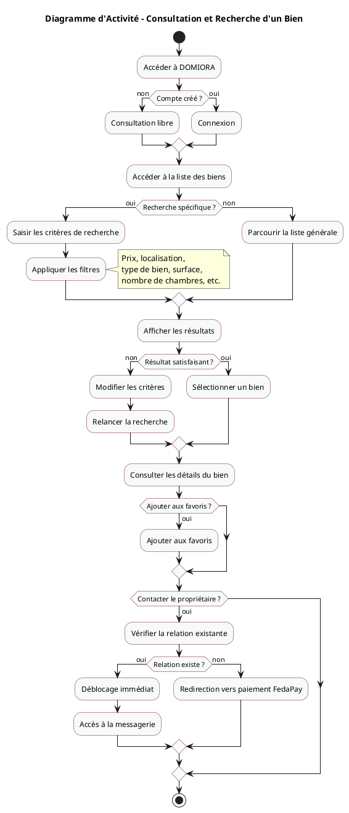

**Explication :** Ce diagramme montre le processus de consultation et de recherche d'un bien. La vérification de la relation existante évite un nouveau paiement si le client a déjà payé pour ce propriétaire.

---

#### 7.1.4.2 Inscription d'un Propriétaire

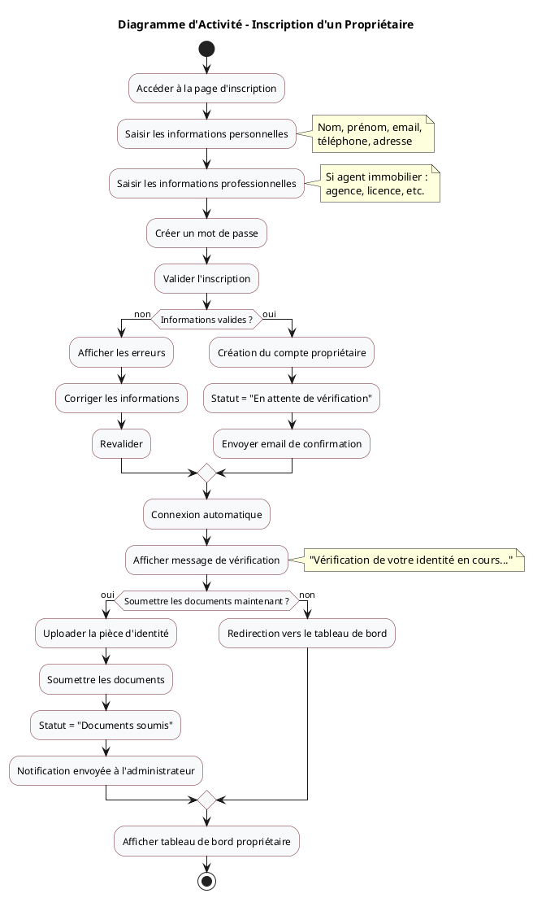

**Explication :** Ce diagramme illustre le processus d'inscription d'un propriétaire. Après inscription, le propriétaire passe en statut "En attente de vérification" et doit soumettre ses documents.

---

#### 7.1.4.3 Vérification de l'Identité et du Bien sur le Terrain

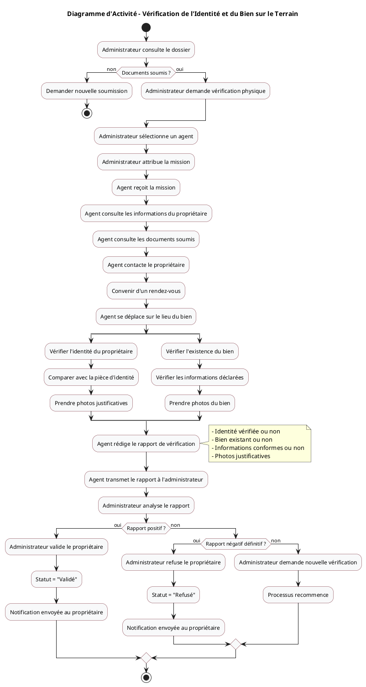

**Explication :** Ce diagramme présente le processus de vérification physique. L'agent effectue la vérification sur le terrain et transmet un rapport à l'administrateur qui prend la décision finale.

---

#### 7.1.4.4 Validation d'un Propriétaire par l'Administrateur

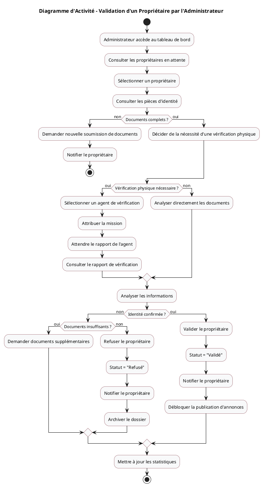

**Explication :** Ce diagramme montre le processus de validation d'un propriétaire par l'administrateur. L'administrateur peut soit valider directement sur dossier, soit demander une vérification physique par un agent.

---

#### 7.1.4.5 Publication et Validation d'une Annonce

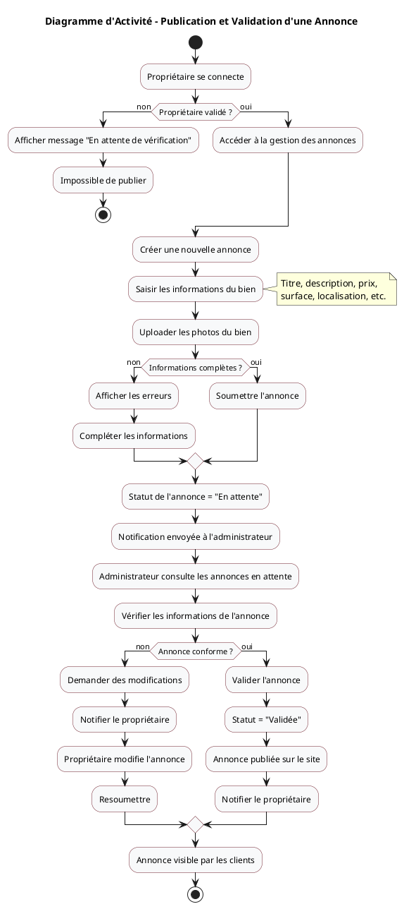

**Explication :** Ce diagramme illustre le processus de publication et validation d'une annonce. Le propriétaire doit être validé pour pouvoir publier, et l'annonce doit être validée par l'administrateur avant d'être visible.

---

#### 7.1.4.6 Paiement FedaPay et Création de la Relation Client-Propriétaire

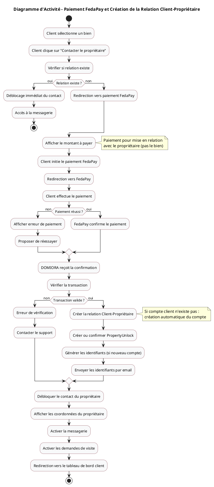

**Explication :** Ce diagramme montre le processus de paiement FedaPay et la création de la relation Client-Propriétaire. Le paiement est associé au propriétaire et non au bien, permettant au client de contacter tous les biens du même propriétaire sans repayer.

---

#### 7.1.4.7 Connexion du Client

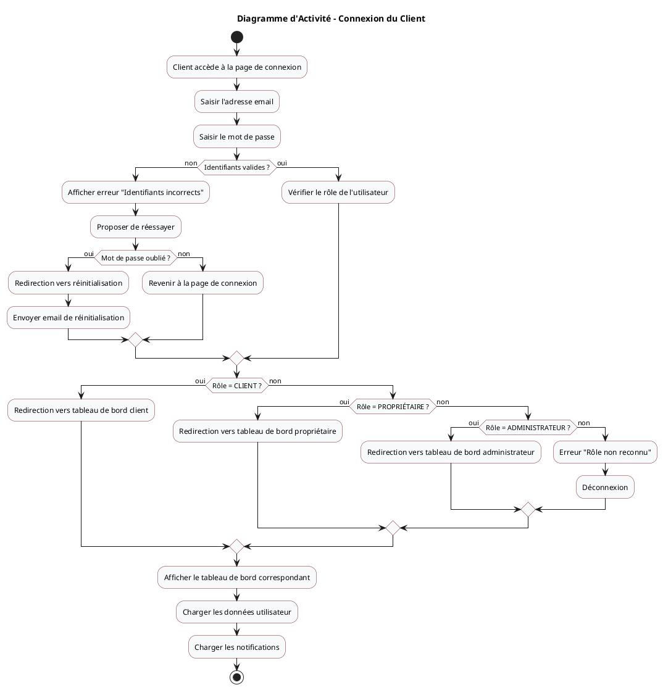

**Explication :** Ce diagramme présente le processus de connexion d'un client. Le système redirige l'utilisateur vers le tableau de bord approprié selon son rôle.

---

#### 7.1.4.8 Demande de Visite

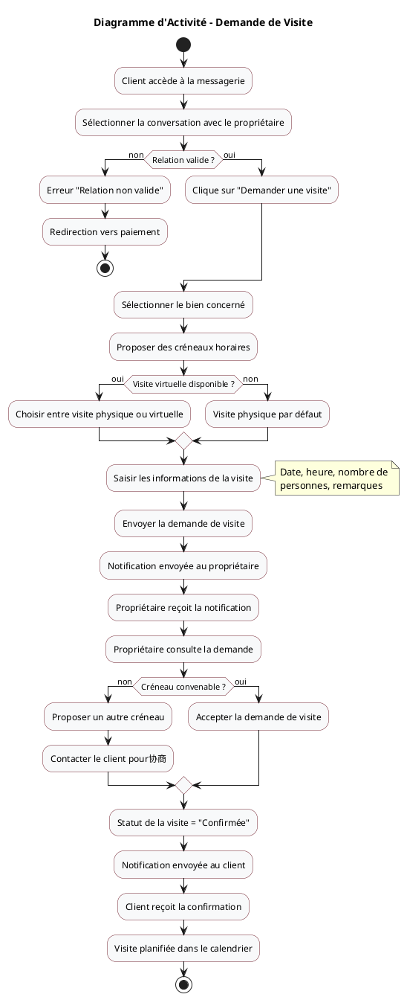

**Explication :** Ce diagramme illustre le processus de demande de visite. La visite nécessite une relation valide entre le client et le propriétaire.

---

#### 7.1.4.9 Communication entre Client et Propriétaire

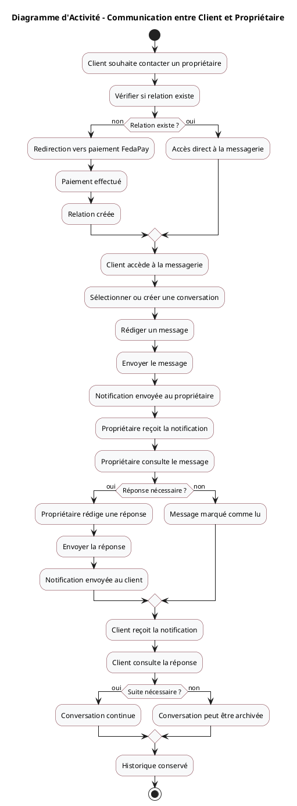

**Explication :** Ce diagramme montre le processus de communication entre un client et un propriétaire. La messagerie n'est accessible que si une relation valide existe entre les deux parties.

---

### 7.1.5 DIAGRAMMES DE SÉQUENCES

#### 7.1.5.1 Consultation d'un Bien

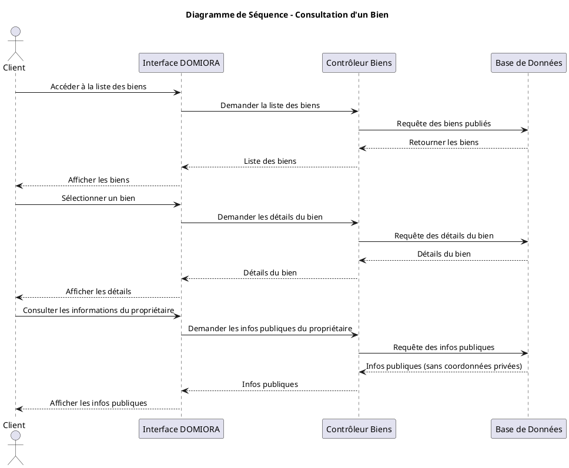

**Explication :** Ce diagramme montre la séquence d'interactions lors de la consultation d'un bien. Les coordonnées privées du propriétaire ne sont jamais affichées.

---

#### 7.1.5.2 Inscription d'un Propriétaire

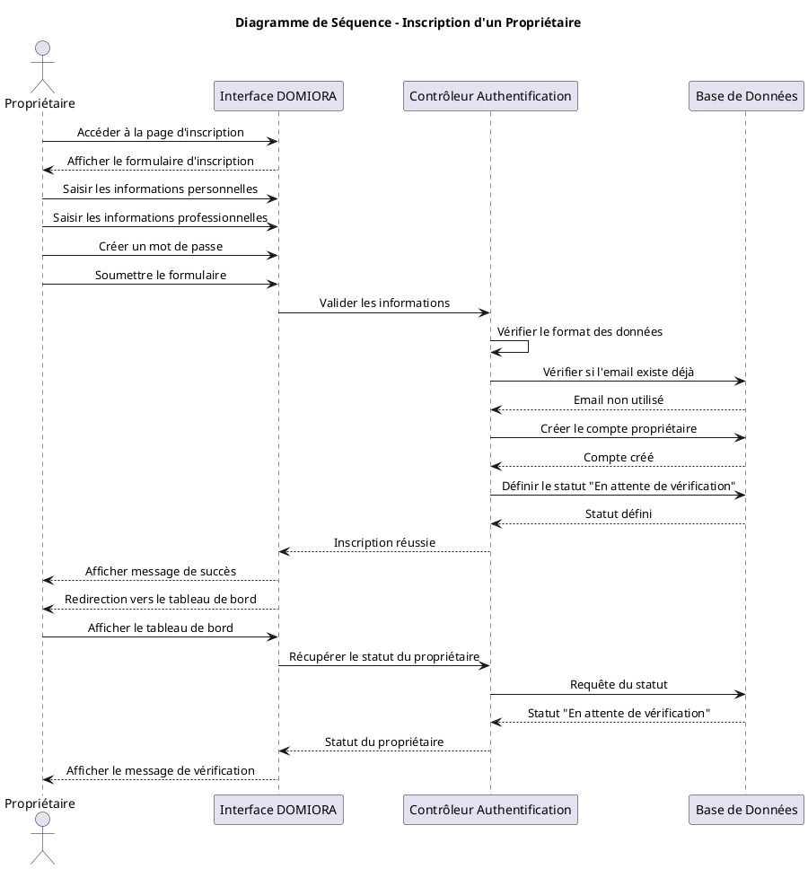

**Explication :** Ce diagramme illustre la séquence d'interactions lors de l'inscription d'un propriétaire. Après inscription, le propriétaire passe en statut "En attente de vérification".

---

#### 7.1.5.3 Soumission d'une Pièce d'Identité

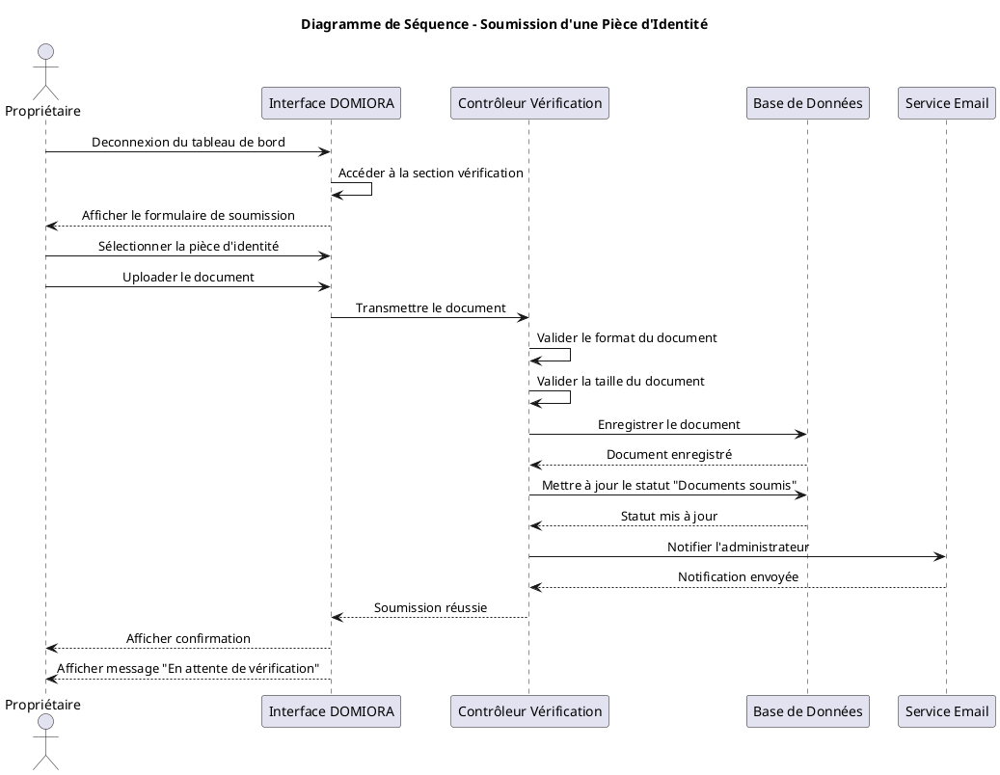

**Explication :** Ce diagramme montre la séquence d'interactions lors de la soumission d'une pièce d'identité. L'administrateur est notifié automatiquement.

---

#### 7.1.5.4 Vérification du Propriétaire et du Bien par l'Agent

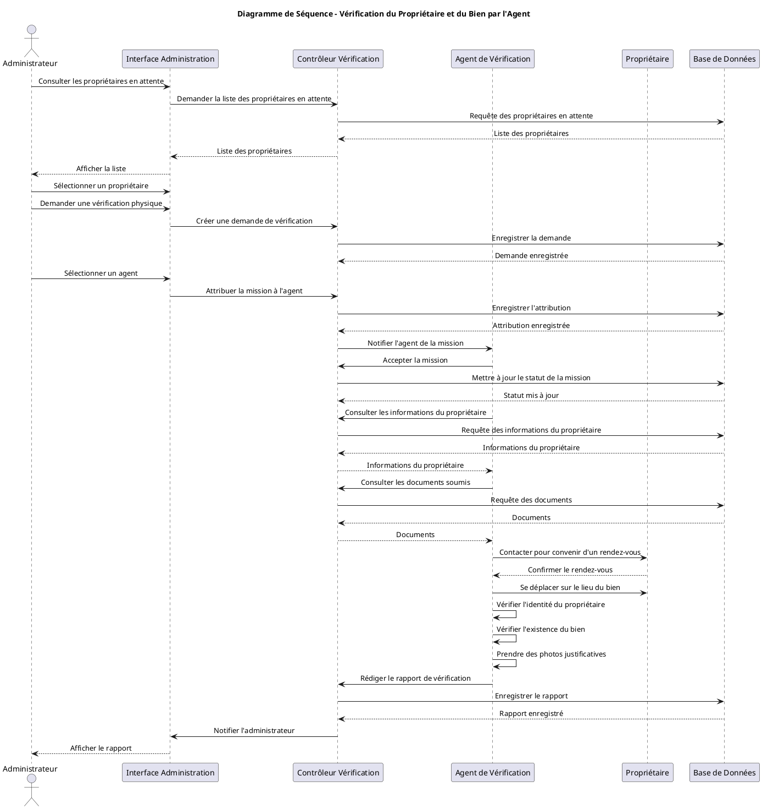

**Explication :** Ce diagramme présente la séquence d'interactions lors de la vérification par l'agent. L'agent effectue la vérification sur le terrain et transmet un rapport à l'administrateur.

---

#### 7.1.5.5 Validation de l'Identité par l'Administrateur

```plantuml
@startuml
skinparam sequenceMessageAlign center
skinparam participantPadding 10
skinparam boxPadding 10

title Diagramme de Séquence - Validation de l'Identité par l'Administrateur

actor "Administrateur" as ADMIN
participant "Interface Administration" as UI_ADMIN
participant "Contrôleur Vérification" as VERIF
participant "Base de Données" as BD
participant "Service Email" as EMAIL
participant "Propriétaire" as PROPRIETAIRE

ADMIN -> UI_ADMIN : Consulter le rapport de vérification
UI_ADMIN -> VERIF : Demander le rapport
VERIF -> BD : Requête du rapport
BD --> VERIF : Rapport de vérification
VERIF --> UI_ADMIN : Rapport
UI_ADMIN --> ADMIN : Afficher le rapport

ADMIN -> UI_ADMIN : Analyser le rapport

alt Rapport positif
  ADMIN -> UI_ADMIN : Valider le propriétaire
  UI_ADMIN -> VERIF : Demander la validation
  VERIF -> BD : Mettre à jour le statut "Validé"
  BD --> VERIF : Statut mis à jour
  VERIF -> EMAIL : Notifier le propriétaire
  EMAIL --> PROPRIETAIRE : Email de validation
  VERIF -> BD : Débloquer la publication d'annonces
  BD --> VERIF : Publication débloquée
else Rapport négatif
  ADMIN -> UI_ADMIN : Refuser le propriétaire
  UI_ADMIN -> VERIF : Demander le refus
  VERIF -> BD : Mettre à jour le statut "Refusé"
  BD --> VERIF : Statut mis à jour
  VERIF -> EMAIL : Notifier le propriétaire
  EMAIL --> PROPRIETAIRE : Email de refus
else Informations insuffisantes
  ADMIN -> UI_ADMIN : Demander une nouvelle vérification
  UI_ADMIN -> VERIF : Créer une nouvelle demande
  VERIF -> BD : Enregistrer la nouvelle demande
  BD --> VERIF : Demande enregistrée
end

VERIF --> UI_ADMIN : Confirmation de l'action
UI_ADMIN --> ADMIN : Afficher confirmation

@enduml
```

**Explication :** Ce diagramme montre la séquence d'interactions lors de la validation d'un propriétaire par l'administrateur. L'administrateur peut valider, refuser ou demander une nouvelle vérification.

---

#### 7.1.5.6 Paiement FedaPay

```plantuml
@startuml
skinparam sequenceMessageAlign center
skinparam participantPadding 10
skinparam boxPadding 10

title Diagramme de Séquence - Paiement FedaPay

actor "Client" as CLIENT
participant "Interface DOMIORA" as UI
participant "Contrôleur Paiement" as PAIEMENT
participant "API FedaPay" as FEDAPAY
participant "Base de Données" as BD

CLIENT -> UI : Cliquer sur "Contacter le propriétaire"
UI -> PAIEMENT : Vérifier si relation existe
PAIEMENT -> BD : Requête de relation existante
BD --> PAIEMENT : Relation non trouvée

PAIEMENT --> UI : Aucune relation existante
UI --> CLIENT : Afficher le formulaire de paiement

CLIENT -> UI : Confirmer le paiement
UI -> PAIEMENT : Initier le paiement
PAIEMENT -> PAIEMENT : Générer les données de paiement
PAIEMENT -> FEDAPAY : Envoyer la demande de paiement
FEDAPAY --> PAIEMENT : URL de paiement générée
PAIEMENT --> UI : Redirection vers FedaPay
UI --> CLIENT : Redirection vers FedaPay

CLIENT -> FEDAPAY : Effectuer le paiement
FEDAPAY -> FEDAPAY : Traiter le paiement

alt Paiement réussi
  FEDAPAY -> PAIEMENT : Webhook de confirmation
  PAIEMENT -> PAIEMENT : Vérifier la signature
  PAIEMENT -> PAIEMENT : Vérifier le montant
  PAIEMENT -> BD : Enregistrer la transaction
  BD --> PAIEMENT : Transaction enregistrée
  PAIEMENT --> FEDAPAY : Confirmation de réception
else Paiement échoué
  FEDAPAY -> PAIEMENT : Webhook d'échec
  PAIEMENT -> BD : Enregistrer l'échec
  BD --> PAIEMENT : Échec enregistré
  PAIEMENT --> UI : Redirection vers erreur
end

@enduml
```

**Explication :** Ce diagramme illustre la séquence d'interactions lors du paiement FedaPay. Le webhook de confirmation permet à DOMIORA de vérifier la transaction.

---

#### 7.1.5.7 Confirmation du Paiement et Création de la Relation

```plantuml
@startuml
skinparam sequenceMessageAlign center
skinparam participantPadding 10
skinparam boxPadding 10

title Diagramme de Séquence - Confirmation du Paiement et Création de la Relation

actor "Client" as CLIENT
participant "Interface DOMIORA" as UI
participant "Contrôleur Paiement" as PAIEMENT
participant "Contrôleur Relations" as RELATION
participant "Contrôleur Authentification" as AUTH
participant "Base de Données" as BD
participant "Service Email" as EMAIL

PAIEMENT -> PAIEMENT : Recevoir la confirmation FedaPay
PAIEMENT -> BD : Vérifier la transaction
BD --> PAIEMENT : Transaction valide

PAIEMENT -> RELATION : Demander la création de relation
RELATION -> BD : Vérifier si le client existe
BD --> RELATION : Client non trouvé

RELATION -> AUTH : Créer le compte client
AUTH -> BD : Créer l'utilisateur
BD --> AUTH : Utilisateur créé
AUTH -> AUTH : Générer les identifiants
AUTH -> EMAIL : Envoyer les identifiants par email
EMAIL --> CLIENT : Email avec identifiants

RELATION -> BD : Créer la relation Client-Propriétaire
BD --> RELATION : Relation créée
RELATION -> BD : Créer PropertyUnlock
BD --> RELATION : PropertyUnlock créé

RELATION -> PAIEMENT : Confirmer la création
PAIEMENT -> UI : Redirection vers confirmation

UI -> BD : Récupérer les coordonnées du propriétaire
BD --> UI : Coordonnées du propriétaire
UI -> CLIENT : Afficher les coordonnées

UI -> CLIENT : Activer la messagerie
UI -> CLIENT : Activer les demandes de visite
UI -> CLIENT : Redirection vers tableau de bord

@enduml
```

**Explication :** Ce diagramme montre la séquence d'interactions après confirmation du paiement. La relation Client-Propriétaire est créée et le compte client est créé automatiquement si nécessaire.

---

#### 7.1.5.8 Connexion du Client

```plantuml
@startuml
skinparam sequenceMessageAlign center
skinparam participantPadding 10
skinparam boxPadding 10

title Diagramme de Séquence - Connexion du Client

actor "Client" as CLIENT
participant "Interface DOMIORA" as UI
participant "Contrôleur Authentification" as AUTH
participant "Base de Données" as BD

CLIENT -> UI : Accéder à la page de connexion
UI --> CLIENT : Afficher le formulaire de connexion

CLIENT -> UI : Saisir l'adresse email
CLIENT -> UI : Saisir le mot de passe
CLIENT -> UI : Soumettre le formulaire

UI -> AUTH : Transmettre les identifiants
AUTH -> BD : Vérifier l'email
BD --> AUTH : Email trouvé

AUTH -> AUTH : Vérifier le mot de passe

alt Identifiants valides
  AUTH -> BD : Récupérer le rôle de l'utilisateur
  BD --> AUTH : Rôle = CLIENT
  AUTH -> UI : Connexion réussie
  UI -> UI : Créer la session
  UI -> CLIENT : Redirection vers tableau de bord client

  UI -> AUTH : Récupérer les données du client
  AUTH -> BD : Requête des données du client
  BD --> AUTH : Données du client
  AUTH --> UI : Données du client
  UI --> CLIENT : Afficher le tableau de bord
else Identifiants invalides
  AUTH -> UI : Identifiants incorrects
  UI --> CLIENT : Afficher erreur
end

@enduml
```

**Explication :** Ce diagramme présente la séquence d'interactions lors de la connexion d'un client. Le système vérifie les identifiants et redirige vers le tableau de bord approprié.

---

#### 7.1.5.9 Contact avec un Propriétaire déjà Mis en Relation

```plantuml
@startuml
skinparam sequenceMessageAlign center
skinparam participantPadding 10
skinparam boxPadding 10

title Diagramme de Séquence - Contact avec un Propriétaire déjà Mis en Relation

actor "Client" as CLIENT
participant "Interface DOMIORA" as UI
participant "Contrôleur Relations" as RELATION
participant "Contrôleur Messagerie" as MESSAGERIE
participant "Base de Données" as BD

CLIENT -> UI : Cliquer sur "Contacter le propriétaire"
UI -> RELATION : Vérifier si relation existe
RELATION -> BD : Requête de relation existante
BD --> RELATION : Relation trouvée

RELATION --> UI : Relation existe déjà
UI --> CLIENT : Afficher confirmation sans paiement

CLIENT -> UI : Accéder à la messagerie
UI -> MESSAGERIE : Demander les conversations
MESSAGERIE -> BD : Requête des conversations du client
BD --> MESSAGERIE : Liste des conversations
MESSAGERIE --> UI : Liste des conversations
UI --> CLIENT : Afficher les conversations

CLIENT -> UI : Sélectionner une conversation
UI -> MESSAGERIE : Demander les messages de la conversation
MESSAGERIE -> BD : Requête des messages
BD --> MESSAGERIE : Messages de la conversation
MESSAGERIE --> UI : Messages
UI --> CLIENT : Afficher les messages

CLIENT -> UI : Rédiger un message
UI -> MESSAGERIE : Envoyer le message
MESSAGERIE -> BD : Enregistrer le message
BD --> MESSAGERIE : Message enregistré
MESSAGERIE -> UI : Confirmation d'envoi
UI --> CLIENT : Afficher le message envoyé

@enduml
```

**Explication :** Ce diagramme montre la séquence d'interactions lors du contact avec un propriétaire déjà mis en relation. Aucun paiement n'est nécessaire car la relation existe déjà.

---

#### 7.1.5.10 Contact avec un Nouveau Propriétaire

```plantuml
@startuml
skinparam sequenceMessageAlign center
skinparam participantPadding 10
skinparam boxPadding 10

title Diagramme de Séquence - Contact avec un Nouveau Propriétaire

actor "Client" as CLIENT
participant "Interface DOMIORA" as UI
participant "Contrôleur Relations" as RELATION
participant "Contrôleur Paiement" as PAIEMENT
participant "API FedaPay" as FEDAPAY
participant "Base de Données" as BD

CLIENT -> UI : Cliquer sur "Contacter le propriétaire"
UI -> RELATION : Vérifier si relation existe
RELATION -> BD : Requête de relation existante
BD --> RELATION : Relation non trouvée

RELATION --> UI : Aucune relation existante
UI --> CLIENT : Afficher le formulaire de paiement

CLIENT -> UI : Confirmer le paiement
UI -> PAIEMENT : Initier le paiement
PAIEMENT -> FEDAPAY : Envoyer la demande de paiement
FEDAPAY --> PAIEMENT : URL de paiement générée
PAIEMENT --> UI : Redirection vers FedaPay
UI --> CLIENT : Redirection vers FedaPay

CLIENT -> FEDAPAY : Effectuer le paiement
FEDAPAY -> PAIEMENT : Webhook de confirmation
PAIEMENT -> BD : Vérifier et enregistrer la transaction
BD --> PAIEMENT : Transaction enregistrée

PAIEMENT -> RELATION : Demander la création de relation
RELATION -> BD : Créer la relation Client-Propriétaire
BD --> RELATION : Relation créée
RELATION -> BD : Créer PropertyUnlock
BD --> RELATION : PropertyUnlock créé

RELATION -> UI : Redirection vers confirmation
UI -> BD : Récupérer les coordonnées du propriétaire
BD --> UI : Coordonnées du propriétaire
UI --> CLIENT : Afficher les coordonnées

UI -> CLIENT : Activer la messagerie
UI -> CLIENT : Redirection vers tableau de bord

@enduml
```

**Explication :** Ce diagramme illustre la séquence d'interactions lors du contact avec un nouveau propriétaire. Le paiement est nécessaire pour créer la relation.

---

#### 7.1.5.11 Publication et Validation d'une Annonce

```plantuml
@startuml
skinparam sequenceMessageAlign center
skinparam participantPadding 10
skinparam boxPadding 10

title Diagramme de Séquence - Publication et Validation d'une Annonce

actor "Propriétaire" as PROPRIETAIRE
participant "Interface DOMIORA" as UI
participant "Contrôleur Annonces" as ANNONCES
participant "Contrôleur Vérification" as VERIF
participant "Base de Données" as BD
participant "Administrateur" as ADMIN
participant "Interface Administration" as UI_ADMIN

PROPRIETAIRE -> UI : Accéder au tableau de bord
UI -> VERIF : Vérifier le statut du propriétaire
VERIF -> BD : Requête du statut
BD --> VERIF : Statut "Validé"
VERIF --> UI : Propriétaire validé
UI --> PROPRIETAIRE : Afficher le tableau de bord

PROPRIETAIRE -> UI : Cliquer sur "Créer une annonce"
UI --> PROPRIETAIRE : Afficher le formulaire de création

PROPRIETAIRE -> UI : Saisir les informations du bien
PROPRIETAIRE -> UI : Uploader les photos
PROPRIETAIRE -> UI : Soumettre l'annonce

UI -> ANNONCES : Valider les informations
ANNONCES -> BD : Enregistrer l'annonce
BD --> ANNONCES : Annonce enregistrée
ANNONCES -> BD : Définir le statut "En attente"
BD --> ANNONCES : Statut défini

ANNONCES -> UI : Annonce soumise
UI --> PROPRIETAIRE : Afficher confirmation

UI_ADMIN -> ANNONCES : Consulter les annonces en attente
ANNONCES -> BD : Requête des annonces en attente
BD --> ANNONCES : Liste des annonces
ANNONCES --> UI_ADMIN : Liste des annonces
UI_ADMIN --> ADMIN : Afficher les annonces

ADMIN -> UI_ADMIN : Sélectionner une annonce
ADMIN -> UI_ADMIN : Valider l'annonce
UI_ADMIN -> ANNONCES : Demander la validation
ANNONCES -> BD : Mettre à jour le statut "Validée"
BD --> ANNONCES : Statut mis à jour
ANNONCES -> BD : Publier l'annonce
BD --> ANNONCES : Annonce publiée

ANNONCES -> UI : Notifier le propriétaire
UI --> PROPRIETAIRE : Notification de validation

@enduml
```

**Explication :** Ce diagramme montre la séquence d'interactions lors de la publication et validation d'une annonce. Le propriétaire doit être validé pour pouvoir publier, et l'annonce doit être validée par l'administrateur.

---

#### 7.1.5.12 Envoi d'un Message

```plantuml
@startuml
skinparam sequenceMessageAlign center
skinparam participantPadding 10
skinparam boxPadding 10

title Diagramme de Séquence - Envoi d'un Message

actor "Client" as CLIENT
participant "Interface DOMIORA" as UI
participant "Contrôleur Messagerie" as MESSAGERIE
participant "Contrôleur Relations" as RELATION
participant "Base de Données" as BD
participant "Propriétaire" as PROPRIETAIRE
participant "Service Notification" as NOTIF

CLIENT -> UI : Accéder à la messagerie
UI -> RELATION : Vérifier la relation
RELATION -> BD : Requête de relation
BD --> RELATION : Relation valide
RELATION --> UI : Relation valide
UI --> CLIENT : Afficher la messagerie

CLIENT -> UI : Sélectionner une conversation
UI -> MESSAGERIE : Demander les messages
MESSAGERIE -> BD : Requête des messages
BD --> MESSAGERIE : Messages
MESSAGERIE --> UI : Messages
UI --> CLIENT : Afficher les messages

CLIENT -> UI : Rédiger un message
CLIENT -> UI : Envoyer le message
UI -> MESSAGERIE : Transmettre le message
MESSAGERIE -> RELATION : Vérifier la relation
RELATION -> BD : Requête de relation
BD --> RELATION : Relation valide
RELATION --> MESSAGERIE : Relation valide

MESSAGERIE -> BD : Enregistrer le message
BD --> MESSAGERIE : Message enregistré
MESSAGERIE -> NOTIF : Notifier le propriétaire
NOTIF --> PROPRIETAIRE : Notification de nouveau message

MESSAGERIE --> UI : Confirmation d'envoi
UI --> CLIENT : Afficher le message envoyé

@enduml
```

**Explication :** Ce diagramme présente la séquence d'interactions lors de l'envoi d'un message. La relation Client-Propriétaire est vérifiée avant l'envoi du message.

---

#### 7.1.5.13 Demande de Visite

```plantuml
@startuml
skinparam sequenceMessageAlign center
skinparam participantPadding 10
skinparam boxPadding 10

title Diagramme de Séquence - Demande de Visite

actor "Client" as CLIENT
participant "Interface DOMIORA" as UI
participant "Contrôleur Visites" as VISITES
participant "Contrôleur Relations" as RELATION
participant "Base de Données" as BD
participant "Propriétaire" as PROPRIETAIRE
participant "Service Notification" as NOTIF

CLIENT -> UI : Accéder à la conversation
UI -> RELATION : Vérifier la relation
RELATION -> BD : Requête de relation
BD --> RELATION : Relation valide
RELATION --> UI : Relation valide
UI --> CLIENT : Afficher la conversation

CLIENT -> UI : Cliquer sur "Demander une visite"
UI --> CLIENT : Afficher le formulaire de visite

CLIENT -> UI : Sélectionner le bien
CLIENT -> UI : Proposer des créneaux
CLIENT -> UI : Saisir les informations
CLIENT -> UI : Envoyer la demande

UI -> VISITES : Transmettre la demande
VISITES -> RELATION : Vérifier la relation
RELATION -> BD : Requête de relation
BD --> RELATION : Relation valide
RELATION --> VISITES : Relation valide

VISITES -> BD : Enregistrer la demande de visite
BD --> VISITES : Demande enregistrée
VISITES -> NOTIF : Notifier le propriétaire
NOTIF --> PROPRIETAIRE : Notification de demande de visite

VISITES --> UI : Confirmation d'envoi
UI --> CLIENT : Afficher la demande envoyée

PROPRIETAIRE -> UI : Consulter la demande
UI -> VISITES : Demander les détails de la visite
VISITES -> BD : Requête des détails
BD --> VISITES : Détails de la visite
VISITES --> UI : Détails
UI --> PROPRIETAIRE : Afficher les détails

PROPRIETAIRE -> UI : Accepter la visite
UI -> VISITES : Confirmer l'acceptation
VISITES -> BD : Mettre à jour le statut "Confirmée"
BD --> VISITES : Statut mis à jour
VISITES -> NOTIF : Notifier le client
NOTIF --> CLIENT : Notification de confirmation

@enduml
```

**Explication :** Ce diagramme illustre la séquence d'interactions lors d'une demande de visite. La relation Client-Propriétaire est vérifiée et le propriétaire est notifié de la demande.

---

### 7.1.6 DIAGRAMME DE CLASSES

```plantuml
@startuml
skinparam class {
    BackgroundColor #f8f9fa
    BorderColor #71212d
}

title Diagramme de Classes - DOMIORA

class Utilisateur {
    - id : Integer
    - email : String
    - mot_de_passe : String
    - nom : String
    - prenom : String
    - telephone : String
    - photo_profil : String
    - date_creation : DateTime
    + se_connecter() : Boolean
    + se_deconnecter() : Void
    + mettre_a_jour_profil() : Void
}

class Client {
    - id : Integer
    - date_inscription : DateTime
    + consulter_biens() : List<BienImmobilier>
    + rechercher_biens() : List<BienImmobilier>
    + contacter_proprietaire() : Boolean
    + envoyer_message() : Void
    + demander_visite() : Void
}

class Proprietaire {
    - id : Integer
    - statut_verification : String
    - date_verification : DateTime
    + soumettre_documents() : Boolean
    + creer_annonce() : Boolean
    + modifier_annonce() : Boolean
    + supprimer_annonce() : Boolean
    + repondre_client() : Void
    + consulter_statistiques() : Map
}

class Administrateur {
    - id : Integer
    - date_nomination : DateTime
    + gerer_utilisateurs() : Void
    + valider_proprietaire() : Boolean
    + refuser_proprietaire() : Boolean
    + valider_annonce() : Boolean
    + affecter_agent() : Void
    + consulter_rapports() : List<Rapport>
    + generer_rapports() : Void
}

class AgentVerification {
    - id : Integer
    - nom : String
    - prenom : String
    - telephone : String
    - specialites : List<String>
    + recevoir_mission() : Void
    + verifier_identite() : Boolean
    + verifier_bien() : Boolean
    + rediger_rapport() : Rapport
    + transmettre_rapport() : Void
}

class BienImmobilier {
    - id : Integer
    - titre : String
    - description : String
    - type_transaction : String
    - type_bien : String
    - prix : Decimal
    - surface : Decimal
    - chambres : Integer
    - salles_de_bain : Integer
    - adresse : String
    - ville : String
    - pays : String
    - latitude : Decimal
    - longitude : Decimal
    - statut_validation : String
    - date_publication : DateTime
    + ajouter_photo() : Void
    + modifier_infos() : Void
    + calculer_score_qualite() : Integer
}

class VerificationIdentite {
    - id : Integer
    - date_soumission : DateTime
    - date_verification : DateTime
    - statut : String
    - rapport : String
    + soumettre_documents() : Boolean
    + planifier_verification() : Void
}

class VerificationBien {
    - id : Integer
    - date_verification : DateTime
    - statut : String
    - rapport : String
    - photos : List<String>
    + verifier_existence() : Boolean
    + verifier_conformite() : Boolean
}

class Relation {
    - id : Integer
    - date_creation : DateTime
    - statut : String
    + activer_messagerie() : Boolean
    + activer_visites() : Boolean
    + verifier_validite() : Boolean
}

class TransactionFedaPay {
    - id : Integer
    - montant : Decimal
    - date_transaction : DateTime
    - statut : String
    - reference_transaction : String
    + initier_paiement() : String
    + verifier_paiement() : Boolean
    + confirmer_transaction() : Boolean
}

class Message {
    - id : Integer
    - contenu : String
    - date_envoi : DateTime
    - type_message : String
    - statut_lecture : Boolean
    + envoyer() : Boolean
    + marquer_lu() : Void
    + supprimer() : Void
}

class Visite {
    - id : Integer
    - date_proposee : DateTime
    - date_confirmee : DateTime
    - statut : String
    - remarques : String
    + proposer_creneau() : Boolean
    + confirmer_visite() : Boolean
    + annuler_visite() : Boolean
}

class RendezVous {
    - id : Integer
    - date : DateTime
    - duree : Integer
    - lieu : String
    - statut : String
    + planifier() : Boolean
    + confirmer() : Boolean
    + reprogrammer() : Boolean
}

Utilisateur <|-- Client
Utilisateur <|-- Proprietaire
Utilisateur <|-- Administrateur
Utilisateur <|-- AgentVerification

Proprietaire "1" --> "*" BienImmobilier : possède
BienImmobilier "*" --> "1" Proprietaire : appartient à

Proprietaire "1" --> "*" VerificationIdentite : fait l'objet de
VerificationIdentite "*" --> "1" Proprietaire : concerne

BienImmobilier "1" --> "*" VerificationBien : fait l'objet de
VerificationBien "*" --> "1" BienImmobilier : concerne

AgentVerification "1" --> "*" VerificationIdentite : réalise
AgentVerification "1" --> "*" VerificationBien : réalise

Administrateur "1" --> "*" VerificationIdentite : analyse
Administrateur "1" --> "*" VerificationBien : analyse

Client "1" --> "*" Relation : possède
Relation "*" --> "1" Client : concerne
Relation "*" --> "1" Proprietaire : concerne

TransactionFedaPay "1" --> "1" Relation : crée ou confirme

Relation "1" --> "*" Message : permet
Message "*" --> "1" Relation : appartient à

Relation "1" --> "*" Visite : permet
Visite "*" --> "1" Relation : appartient à

Visite "1" --> "1" RendezVous : génère
RendezVous "1" --> "1" Visite : concerne

note right of AgentVerification
  L'agent réalise les vérifications
  mais ne prend aucune décision finale
end note

note right of Administrateur
  L'administrateur analyse les rapports
  et prend la décision finale
end note

@enduml
```

**Explication :** Ce diagramme de classes présente la structure du système DOMIORA. Les relations entre les classes montrent le flux de données et les responsabilités de chaque acteur.

---

### 7.1.7 DIAGRAMMES D'OBJETS

#### 7.1.7.1 Scénario : Client Kossi contacte le Propriétaire Afi

```plantuml
@startuml
skinparam object {
    BackgroundColor #f8f9fa
    BorderColor #71212d
}

title Diagramme d'Objets - Scénario : Client Kossi contacte le Propriétaire Afi

object "client_001\nClient" as client {
    id = 1
    nom = "Kossi"
    prenom = "Koffi"
    email = "kossi@email.com"
    telephone = "+22890000000"
    date_inscription = 2026-08-15
}

object "proprietaire_001\nProprietaire" as proprietaire {
    id = 1
    nom = "Afi"
    prenom = "Mawuena"
    email = "afi@email.com"
    telephone = "+22891000000"
    statut_verification = "Validé"
    date_verification = 2026-08-20
}

object "bien_001\nBienImmobilier" as bien {
    id = 1
    titre = "Appartement F2 Lomé"
    type_transaction = "Location"
    type_bien = "Appartement"
    prix = 150000
    surface = 65
    chambres = 2
    salles_de_bain = 1
    adresse = "Rue du Commerce, Lomé"
    statut_validation = "Validée"
    date_publication = 2026-08-22
}

object "transaction_001\nTransactionFedaPay" as transaction {
    id = 1
    montant = 500
    date_transaction = 2026-08-25
    statut = "Réussie"
    reference_transaction = "FED-20260825-001"
}

object "relation_001\nRelation" as relation {
    id = 1
    date_creation = 2026-08-25
    statut = "Active"
}

object "message_001\nMessage" as message {
    id = 1
    contenu = "Bonjour, je suis intéressé par votre appartement F2"
    date_envoi = 2026-08-25 14:30
    type_message = "texte"
    statut_lecture = false
}

client --> relation : possède
proprietaire --> relation : concerne
bien --> proprietaire : appartient à
transaction --> relation : crée
relation --> message : permet

note right of relation
  Relation créée après
  paiement FedaPay réussi
end note

note bottom of message
  Message envoyé après
  déblocage de la messagerie
end note

@enduml
```

**Explication :** Ce diagramme d'objets représente un scénario fictif où le client Kossi contacte le propriétaire Afi après avoir effectué un paiement FedaPay. La relation est créée et la messagerie est débloquée.

---

#### 7.1.7.2 Scénario : Vérification du Propriétaire Afi

```plantuml
@startuml
skinparam object {
    BackgroundColor #f8f9fa
    BorderColor #71212d
}

title Diagramme d'Objets - Scénario : Vérification du Propriétaire Afi

object "proprietaire_001\nProprietaire" as proprietaire {
    id = 1
    nom = "Afi"
    prenom = "Mawuena"
    email = "afi@email.com"
    telephone = "+22891000000"
    statut_verification = "En attente"
}

object "verification_identite_001\nVerificationIdentite" as verification {
    id = 1
    date_soumission = 2026-08-18
    date_verification = null
    statut = "En attente"
    rapport = null
}

object "agent_001\nAgentVerification" as agent {
    id = 1
    nom = "Kouassi"
    prenom = "Komlan"
    telephone = "+22892000000"
    specialites = ["Identité", "Bien immobilier"]
}

object "rapport_001\nRapport" as rapport {
    id = 1
    date_redaction = 2026-08-20
    contenu = "Identité vérifiée. Bien conforme aux informations déclarées."
    statut = "Positif"
    photos = ["photo1.jpg", "photo2.jpg"]
}

object "administrateur_001\nAdministrateur" as admin {
    id = 1
    nom = "Admin"
    prenom = "Système"
    email = "admin@domiora.com"
    date_nomination = 2026-01-01
}

proprietaire --> verification : fait l'objet de
verification --> agent : réalisée par
agent --> rapport : rédige
rapport --> admin : transmis à
admin --> proprietaire : valide

note right of verification
  Soumission des documents
  le 2026-08-18
end note

note right of agent
  Agent mandaté par
  l'administrateur
end note

note bottom of rapport
  Rapport transmis à
  l'administrateur pour
  décision finale
end note

note bottom of admin
  Après analyse du rapport,
  l'administrateur valide
  le propriétaire
end note

@enduml
```

**Explication :** Ce diagramme d'objets représente le processus de vérification du propriétaire Afi. L'agent effectue la vérification et transmet un rapport à l'administrateur qui prend la décision finale.

---

### 7.1.8 DIAGRAMME D'ÉTAT-TRANSITION

```plantuml
@startuml
skinparam state {
    BackgroundColor #f8f9fa
    BorderColor #71212d
}

title Diagramme d'État-Transition - Cycle de Vie d'une Annonce

[*] --> Brouillon : Création par le propriétaire

state Brouillon {
    [*] --> EnEdition
    EnEdition --> Brouillon : Sauvegarde
}

Brouillon --> EnAttente : Soumission
note right
  Si propriétaire validé
end note

EnAttente --> EnCoursVerification : Administrateur demande vérification
EnCoursVerification --> EnAttente : Vérification complémentaire demandée

EnAttente --> Validee : Validation par l'administrateur
note right
  Condition 1 : Propriétaire validé
  Condition 2 : Annonce validée
end note

Validee --> Publiee : Publication automatique
Publiee --> Louee_Vendue : Transaction réussie

EnAttente --> Refusee : Refus par l'administrateur
Validee --> Suspendue : Suspension par l'administrateur
Publiee --> Suspendue : Suspension par l'administrateur
Suspendue --> Publiee : Réactivation par l'administrateur

Refusee --> Brouillon : Modification et resoumission
Suspendue --> Brouillon : Modification et resoumission

Louee_Vendue --> [*] : Archivage

state "Conditions de Publication" as conditions {
  [*] --> Condition1
  [*] --> Condition2
  Condition1 : Propriétaire validé
  Condition2 : Annonce validée
}

note right of EnAttente
  Statut initial après
  soumission par le propriétaire
end note

note right of Validee
  Annonce prête à être publiée
  si propriétaire validé
end note

note bottom of Suspendue
  Annonce temporairement
  indisponible
end note

@enduml
```

**Explication :** Ce diagramme d'état-transition représente le cycle de vie d'une annonce. La publication dépend de deux conditions : le propriétaire doit être validé et l'annonce doit être validée par l'administrateur.

---

### 7.1.9 MODÈLE ENTITÉ-RELATIONNEL

```plantuml
@startuml
skinparam entity {
    BackgroundColor #f8f9fa
    BorderColor #71212d
}

title Modèle Entité-Relationnel - DOMIORA (PostgreSQL)

entity "Utilisateurs" as utilisateurs {
  *id : SERIAL [PK]
  *email : VARCHAR(255) [UNIQUE]
  *mot_de_passe : VARCHAR(255)
  *nom : VARCHAR(100)
  *prenom : VARCHAR(100)
  *telephone : VARCHAR(20)
  photo_profil : VARCHAR(255)
  *role : VARCHAR(20)
  date_creation : TIMESTAMP [DEFAULT NOW()]
  date_modification : TIMESTAMP
}

entity "BiensImmobiliers" as biens {
  *id : SERIAL [PK]
  *titre : VARCHAR(255)
  description : TEXT
  *type_transaction : VARCHAR(50)
  *type_bien : VARCHAR(50)
  *prix : DECIMAL(12,2)
  surface : DECIMAL(10,2)
  chambres : INTEGER
  salles_de_bain : INTEGER
  adresse : VARCHAR(255)
  ville : VARCHAR(100)
  pays : VARCHAR(100)
  latitude : DECIMAL(10,8)
  longitude : DECIMAL(11,8)
  *statut_validation : VARCHAR(20)
  date_publication : TIMESTAMP
  *proprietaire_id : INTEGER [FK]
  date_creation : TIMESTAMP [DEFAULT NOW()]
  date_modification : TIMESTAMP
}

entity "VerificationsIdentite" as verifications_identite {
  *id : SERIAL [PK]
  *proprietaire_id : INTEGER [FK]
  date_soumission : TIMESTAMP
  date_verification : TIMESTAMP
  *statut : VARCHAR(20)
  rapport : TEXT
  documents : TEXT[]
  *agent_id : INTEGER [FK]
  date_creation : TIMESTAMP [DEFAULT NOW()]
}

entity "VerificationsBiens" as verifications_biens {
  *id : SERIAL [PK]
  *bien_id : INTEGER [FK]
  date_verification : TIMESTAMP
  *statut : VARCHAR(20)
  rapport : TEXT
  photos : TEXT[]
  *agent_id : INTEGER [FK]
  date_creation : TIMESTAMP [DEFAULT NOW()]
}

entity "TransactionsFedaPay" as transactions {
  *id : SERIAL [PK]
  *client_id : INTEGER [FK]
  *proprietaire_id : INTEGER [FK]
  *montant : DECIMAL(10,2)
  date_transaction : TIMESTAMP
  *statut : VARCHAR(20)
  reference_transaction : VARCHAR(100)
  date_creation : TIMESTAMP [DEFAULT NOW()]
}

entity "Relations" as relations {
  *id : SERIAL [PK]
  *client_id : INTEGER [FK]
  *proprietaire_id : INTEGER [FK]
  *transaction_id : INTEGER [FK]
  date_creation : TIMESTAMP [DEFAULT NOW()]
  *statut : VARCHAR(20)
  date_modification : TIMESTAMP
}

entity "Messages" as messages {
  *id : SERIAL [PK]
  *relation_id : INTEGER [FK]
  *expediteur_id : INTEGER [FK]
  *destinataire_id : INTEGER [FK]
  *contenu : TEXT
  date_envoi : TIMESTAMP [DEFAULT NOW()]
  *type_message : VARCHAR(20)
  statut_lecture : BOOLEAN [DEFAULT FALSE]
}

entity "Visites" as visites {
  *id : SERIAL [PK]
  *relation_id : INTEGER [FK]
  *bien_id : INTEGER [FK]
  date_proposee : TIMESTAMP
  date_confirmee : TIMESTAMP
  *statut : VARCHAR(20)
  remarques : TEXT
  date_creation : TIMESTAMP [DEFAULT NOW()]
  date_modification : TIMESTAMP
}

entity "RendezVous" as rendezvous {
  *id : SERIAL [PK]
  *visite_id : INTEGER [FK]
  date : TIMESTAMP
  duree : INTEGER
  lieu : VARCHAR(255)
  *statut : VARCHAR(20)
  date_creation : TIMESTAMP [DEFAULT NOW()]
  date_modification : TIMESTAMP
}

utilisateurs ||--o{ biens : "possède"
biens }o--|| utilisateurs : "appartient à"

utilisateurs ||--o{ verifications_identite : "concerne"
verifications_identite }o--|| utilisateurs : "fait l'objet de"

biens ||--o{ verifications_biens : "concerne"
verifications_biens }o--|| biens : "fait l'objet de"

utilisateurs ||--o{ verifications_identite : "réalise"
utilisateurs ||--o{ verifications_biens : "réalise"

utilisateurs ||--o{ transactions : "initie"
utilisateurs ||--o{ transactions : "reçoit"

utilisateurs ||--o{ relations : "possède"
utilisateurs ||--o{ relations : "concerne"

transactions ||--o{ relations : "crée ou confirme"

relations ||--o{ messages : "permet"
relations ||--o{ visites : "permet"

biens ||--o{ visites : "concerne"

visites ||--o{ rendezvous : "génère"
rendezvous }o--|| visites : "concerne"

note right of verifications_identite
  La vérification d'identité
  concerne un propriétaire
end note

note right of verifications_biens
  La vérification d'un bien
  concerne un bien immobilier
end note

note right of relations
  Une relation relie un client
  et un propriétaire
end note

note right of transactions
  Une transaction FedaPay réussie
  crée ou confirme une relation
end note

@enduml
```

**Explication :** Ce modèle Entité-Relationnel présente la structure de la base de données PostgreSQL de DOMIORA. Les relations entre les entités montrent le flux de données et les contraintes d'intégrité.

---

## CONCLUSION

Ce Document d'Analyse Fonctionnelle présente de manière complète et cohérente la plateforme immobilière DOMIORA. Les diagrammes UML (PlantUML) illustrent tous les aspects du système :

- La séparation claire des responsabilités entre les acteurs
- Le processus rigoureux de vérification physique
- L'intégration exclusive de FedaPay pour les paiements
- Le workflow de validation des propriétaires et des annonces
- La gestion des relations Client-Propriétaire
- Le système de messagerie et de demandes de visite

Ce document sert de référence pour le développement, la maintenance et l'évolution de la plateforme DOMIORA.

---

**Document rédigé pour le Projet de Fin d'Études en Génie Logiciel**
**Version 1.0 - 2026**
